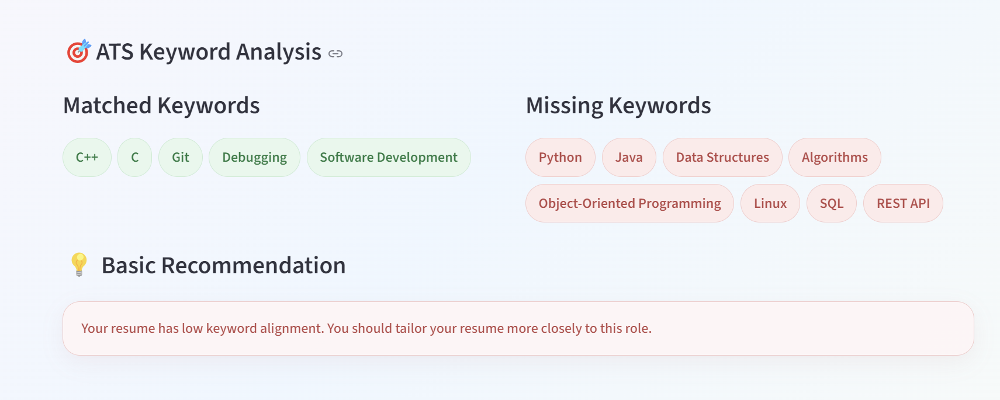
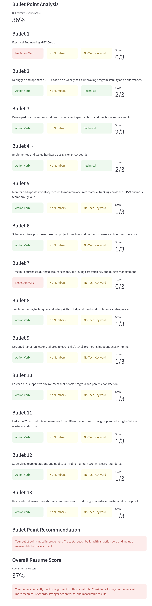
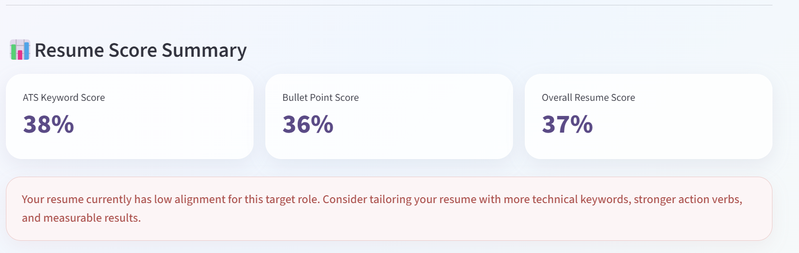
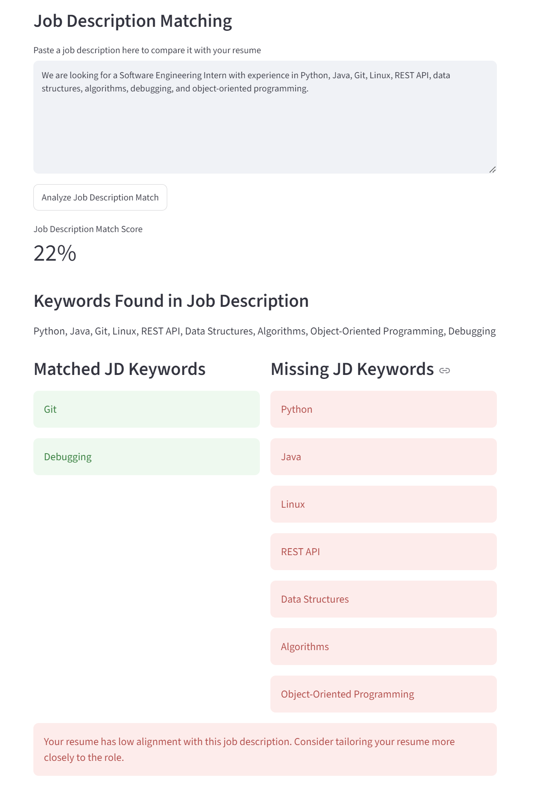

# AI Resume Reviewer

An AI-powered resume review web app built with Python and Streamlit.

This project helps students analyze their resumes for internship applications by extracting text from PDF resumes, checking ATS keyword alignment, evaluating bullet point quality, and generating an overall resume score.

## Features

- Upload a resume PDF
- Extract text from the PDF
- Select a target internship role
- Analyze ATS keyword alignment
- Show matched and missing keywords
- Generate an ATS keyword match score
- Check bullet point quality
- Detect action verbs in bullet points
- Detect technical keywords in bullet points
- Detect quantified impact in bullet points
- Generate a bullet point quality score
- Generate an overall resume score
- Provide basic improvement recommendations
- Paste a job description and compare it against the resume
- Extract supported technical keywords from job descriptions
- Generate a job description match score
- Show matched and missing job description keywords

## Target Roles

The app currently supports keyword analysis for:

- Software Engineering Intern
- AI/ML Intern
- ECE Hardware Intern
- Embedded/Firmware Intern

## Tech Stack

- Python
- Streamlit
- pypdf
- GitHub

## Screenshots

### ATS Keyword Analysis


### Bullet Point Checker


### Overall Resume Score


### Job Description Matcher


## How to Run Locally

1. Clone this repository:

```bash
git clone https://github.com/lucas-wang-ece/ai-resume-viewer.git
```

2. Navigate into the project folder:

```bash
cd ai-resume-viewer
```

3. Install dependencies:

```bash
pip install -r requirements.txt
```

4. Run the Streamlit app:

```bash
py -m streamlit run app.py
```

## Current Status

This project currently supports PDF upload, resume text extraction, target role selection, ATS keyword analysis, job description matching, bullet point quality checking, and overall resume scoring.

## Future Improvements

- Add AI-generated resume feedback
- Add bullet point rewriting suggestions
- Add prompt chaining workflow
- Add downloadable resume report
- Improve keyword matching with weighted scoring
- Add a demo video